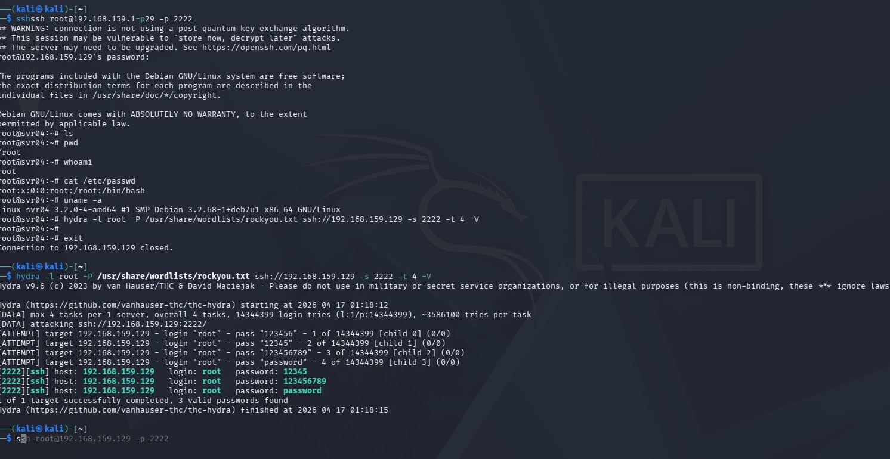
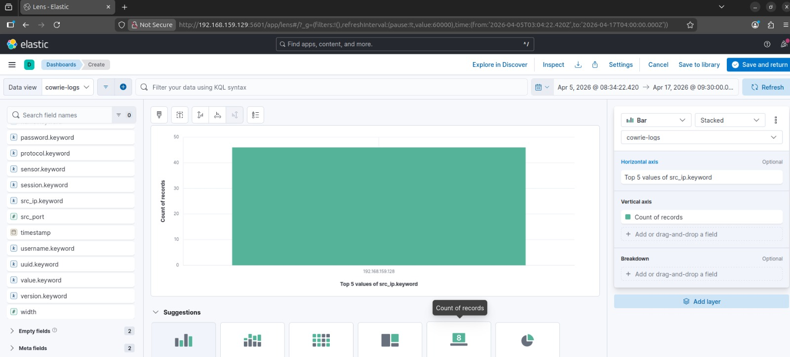
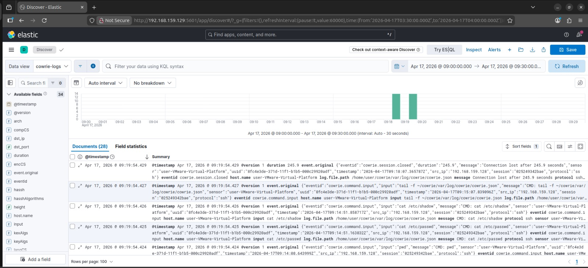

# 🛡️ SSH Honeypot Attack Analysis using Cowrie + ELK Stack

## 📌 Overview

This project demonstrates the deployment of a Cowrie SSH honeypot to capture real-world attack traffic and analyze attacker behavior using the ELK Stack (Elasticsearch, Logstash, Kibana).

The system simulates a vulnerable SSH server, collects attacker activity, and provides near real-time visualization for SOC-style monitoring and threat analysis.

---

## 🛠️ Technologies Used

* Linux (Ubuntu / Kali)
* Cowrie SSH Honeypot
* Elasticsearch
* Logstash
* Kibana
* Python 3
* iptables
* GeoIP (optional)

---

## 🏗️ Architecture

Kali Linux (Attacker)
↓
Cowrie Honeypot (Ubuntu)
↓
Cowrie JSON Logs
↓
Logstash Pipeline
↓
Elasticsearch Index (cowrie-logs)
↓
Kibana Dashboard (Visualization)

---

## ⚔️ Attack Simulation

* SSH brute-force attacks using Hydra
* Manual SSH login attempts
* Post-compromise command execution
* Simulated malicious activity (wget, system enumeration)

---

## 📊 Features

* Real-time attack monitoring using Kibana
* Brute-force detection and logging
* Command execution tracking
* Attacker IP identification
* Session and activity analysis

---

## 🔍 Analysis Performed

* Identified SSH brute-force login attempts
* Extracted attacker IP addresses and usernames
* Monitored commands executed after login
* Observed attacker behavior patterns
* Analyzed session timelines

---

## 📸 Screenshots

### ⚔️ SSH Attack Simulation


---

### 📊 Dashboard Visualization


---

### 🔍 Kibana Discover Logs


---

## 🧪 Sample Log Parsing (Python)

```python
import json

with open("cowrie.json", "r") as f:
    for line in f:
        log = json.loads(line)
        print(log.get("src_ip"), log.get("eventid"))
```

---

## 🚀 Setup Summary

1. Deploy Cowrie honeypot on Ubuntu VM
2. Redirect SSH traffic using iptables
3. Enable JSON logging in Cowrie
4. Configure Logstash pipeline
5. Store logs in Elasticsearch (cowrie-logs index)
6. Visualize logs using Kibana (Discover & Dashboards)

---

## 📈 Outcome

* Successfully simulated real-world SSH attacks
* Built a complete log pipeline using ELK Stack
* Visualized attacker activity in near real-time
* Gained practical SOC monitoring experience

---

## 🧠 Key Learnings

* Understanding attacker behavior and brute-force techniques
* Working with ELK Stack for log analysis
* Importance of centralized logging in security operations
* Hands-on experience with honeypot deployment

---

## 🔐 Security Use Cases

* SSH brute-force detection
* Threat intelligence collection
* SOC monitoring and investigation
* Attack pattern analysis

---

## ⚠️ Disclaimer

This project is for educational and research purposes only. No production systems were harmed.

---

## 👨‍💻 Author
Mohammed Adnan
Likith Kumar
